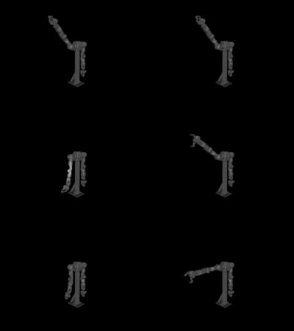
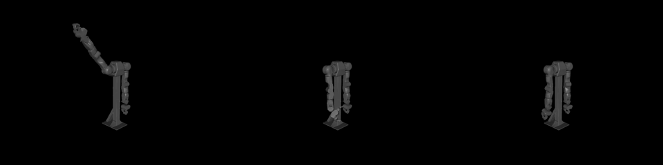

# MuJoCo 물리 시뮬 검증 — 테스트 플랜 (2026-06-15)

## 0. 목적 — viz로 못 보는 "물리" 검증

viz(three.js 기구학)는 강체를 명령 위치에 고정 → **중력·접촉·관성을 못 봄.**
MuJoCo는 OpenArm URDF + 질량/관성(8.0kg)으로 **실제 물리**를 시뮬 → 실물 전 마지막 시뮬 관문.

| 환경 | 검증 |
|---|---|
| viz(기구학) | 매핑·부호·작업공간·연속성 (SV1~7) |
| **MuJoCo(물리)** | **중력 낙하·실패-안전·중력보상·접촉력** (MV1~) |
| 실물 | e-stop·전류·발열·ROS2 네트워크 타이밍 |

## 1. 환경

- MuJoCo 3.9.0 + OpenArm `output.urdf` (package:// 치환 + dae visual 제거 → `output_mjc.urdf` 자동 생성)
- `sim_mujoco/dropsim.py` — 자세별 토크OFF 낙하 + 중력보상 비교
- 모델: 18 joints, 8.0kg, timestep 2ms, 중력 −9.8

## 2. 시나리오

| ID | 내용 | 검증 | 합격/판정 |
|---|---|---|---|
| **MV1 실패-안전 낙하** | 대표 자세 7종에서 토크 OFF 3초 | 자세별 낙하각·손끝추락·속도 | 위험 자세(>30°) 식별 → 실물서 torque-off 금지 구간 |
| **MV2 중력보상 정책** | 각 자세 qfrc_bias 상쇄 | 낙하 막는가 | **전 자세 낙하 ≈0°** = 정책 유효 |
| MV3 안전로직 물리검증 | 속도클램프·freeze를 물리 모델에 (향후) | 명령 점프/끊김 시 거동 | 미니암 D-시리즈의 물리 버전 |
| **MV4 자기충돌** | viz SV6 자세를 MuJoCo 접촉 검사 | 관통 링크쌍 | **실측 완료(아래)** |
| MV5 텔레옵 물리추종 | bridge→MuJoCo 실시간 (향후) | 동역학 포함 추종지연·오버슛 | 정성 |

## 3. MV1·MV2 결과 (실측, 토크OFF 3초)

| 자세 | 최대관절낙하 | 손끝추락 | 최대속도 | 중력보상ON | 판정 |
|---|---|---|---|---|---|
| 중립(팔 아래) | 28° | 0.9cm | 163°/s | 0.0° | 주의 |
| 팔 앞 수평 | 90° | 62cm | 1535°/s | 0.0° | ⚠위험 |
| 팔 옆 수평 | 73° | 42cm | 5112°/s | 0.0° | ⚠위험 |
| 앞으로+팔꿈치90 | 91° | 54cm | 4081°/s | 0.0° | ⚠위험 |
| **팔 들어올림** | **183°** | **81cm** | 3844°/s | 0.0° | ⚠최악 |
| 팔꿈치만 90° | 92° | 38cm | 2746°/s | 0.0° | ⚠위험 |
| 손목 폄+팔수평 | 89° | 61cm | 1070°/s | 0.0° | ⚠위험 |

**결론:**
1. **OpenArm은 "torque-off = 안전"이 성립 안 함** — 거의 모든 텔레옵 자세에서 73~183° 낙하, 손끝 38~81cm 추락, 최대 5112°/s. 미니암(DYNAMIXEL, torque-off=멈춤)과 **정반대**.
2. **중력보상 정책(qfrc_bias 상쇄)이 전 자세 낙하 0** — OpenArm 실패-안전의 정답은 "torque-off"가 아니라 **"이상 시 중력보상 유지 또는 브레이크"**. ROS2 컨트롤러에 이 정책 필수.

## 3-B. 안전 정책 실증 (hold_and_home.py) — 낙하 대책

토크OFF 낙하의 해법을 MuJoCo로 실증 (position 액추에이터 + 중력보상):

**(A) 위치 홀드** = 텔레옵 끊김 시 freeze의 실체. 마지막 자세를 위치제어로 유지.

| 자세 | 위치 홀드 편차 | 외란(밀기) 후 | (비교)토크OFF 낙하 |
|---|---|---|---|
| 팔 들어올림 | 0.06° | 0.00° | 183° |
| 팔 앞 수평 | 0.05° | 0.00° | 90° |
| 팔꿈치만 | 0.00° | 0.00° | 92° |

→ **전 자세 낙하 ≈0°**, 외란에도 복귀. 위치제어가 토크 유지하면 중력 자동으로 버팀(별도 중력보상 모델 불필요).

**(B) 홈 복귀 셧다운** = 정상 종료 시 'torque-off로 떨구기' 대신. 위험 자세 → 홈으로 속도제한 하강.

| 시작 자세 | 홈 도착 오차 | 최대 속도 |
|---|---|---|
| 전 위험 자세 | 0.00° | 40°/s (=속도제한) |

→ 토크OFF 추락(최대 5112°/s)과 대조적으로 40°/s 제어 하강. 앱의 기준좌표 복귀와 동일 발상.



> 위→아래: t=0 / 0.5s / 1.5s, 좌=토크OFF(추락) / 우=홈복귀(안전하강). **t=0.5초에 좌는 이미 추락, 우는 아직 위.**

## 3-C. 종료 상황별 안전 정책 (확정)

| 상황 | 정답 정책 | MuJoCo 검증 |
|---|---|---|
| 텔레옵 끊김(freeze) | **위치 홀드**(토크 유지) | ✅ 낙하 0° |
| 정상 종료 | **홈 복귀 후 토크오프** | ✅ 40°/s 제어 하강 |
| e-stop(비상정지) | 그 자리 위치 홀드 | ✅ (홀드와 동일) |
| 정전(전원 차단) | **모터 브레이크**(물리 잠금) | ❌ 전원 없어 시뮬 불가 — 하드웨어 |

> ⚠ 미니암 안전게이트의 "이상 시 torque-off"는 OpenArm 이식 **금지**(낙하). "토크 유지+홀드" 또는 "홈 복귀"로 재설계. 정전 대비는 브레이크 하드웨어 필수.

## 3-D. MV4 자기충돌 (viz SV6 자세 → MuJoCo 접촉 검사)

viz(기구학)는 강체 관통을 못 봄 → SV6에서 도달한 관절각을 MuJoCo 접촉 물리로 검사:

| 항목 | 결과 |
|---|---|
| 충돌 프레임 | **261/480 샘플 (54%)** — 팔 모으는 자세 절반 이상 |
| 어깨 자기충돌 | **right_link1 ↔ right_link3** (팔 안쪽 모으면 어깨 겹침) |
| 팔↔구조물 | link3·4·5·6 ↔ world(베이스 기둥·바닥) |

→ **사람이 팔을 몸통 쪽으로 모으는 자연스러운 동작이 OpenArm에선 자기충돌.** viz로는 못 보던 걸 MuJoCo 접촉이 정량 검출. **실물 OpenArm은 자기충돌 펜스 필수**(미니암 EEPROM 충돌벽과 다른 새 클래스 — 몸통/베이스/팔링크 전부 회피 대상).

## 4. 실물 OpenArm 전 함의

- 미니암 안전 게이트의 "이상 시 torque-off"는 **OpenArm에 그대로 이식 금지** (낙하).
- ROS2 안전장치는 freeze=중력보상 유지(토크 끄지 않음) 또는 모터 브레이크로 재설계.
- e-stop도 "토크 차단"이면 낙하 → 브레이크 동반 e-stop 필요.

## 5. 영상 (보고서용 — sim_mujoco/videos/)

`render_drop.py` (MuJoCo glfw 오프스크린 + ffmpeg) 로 낙하를 3D 영상화:

| 파일 | 내용 |
|---|---|
| `arm_up_OFF.mp4` | 팔 들어올림 → 토크 OFF → **175° 낙하** |
| `arm_up_GRAVCOMP.mp4` | 같은 자세 → 중력보상 ON → **0° 유지** |
| **`arm_up_COMPARE.mp4`** | **위 둘 나란히** (낙하 vs 유지 — 보고서 핵심) |
| `arm_forward_OFF.mp4` | 팔 앞 수평 → 토크 OFF → 90° 낙하 |
| `arm_up_sequence.png` | 낙하 3컷(t=0 / 0.7s / 2.5s) — md 임베드용 |



> 좌→우: 팔 들어올린 자세 → 토크 끊김 → 중력으로 추락. "OpenArm은 torque-off=낙하"를 한눈에.

## 6. 실행

```bash
cd ~/dev_ws/BandLeadDevice/sim_mujoco
python3 dropsim.py --T 3.0        # 자세별 낙하 + 중력보상 (수치)
MUJOCO_GL=glfw python3 render_drop.py   # 낙하 영상 렌더 → videos/
```

## 6. 다음 (MuJoCo 심화)

- MV3: 속도클램프·freeze 로직을 MuJoCo 컨트롤러로 → 물리 환경 결함주입
- MV4: 테이블/몸통 충돌 geom 추가 → 접촉력
- MV5: bridge(IMU 분해) → MuJoCo 실시간 구동 → 동역학 포함 텔레옵 추종 (오버슛·관성)
- 렌더: MuJoCo 오프스크린 → 낙하 궤적 영상/이미지 (보고서용)
