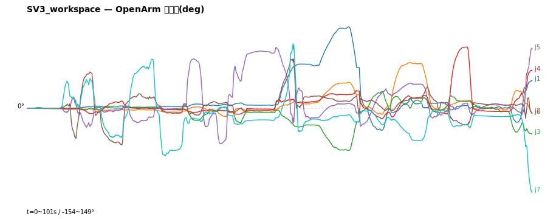

# 시뮬(viz OpenArm) 운동학 검증 보고서

- 생성: 2026-06-15 15:02
- 분해: bridge.py + calib_ik.py (실물 esp 앱과 동일)
- 검증 범위: 매핑·부호·작업공간·연속성 (안전·동역학은 ROS2/실물 영역)

## 20260615_145901_SV3_workspace.csv

- 시나리오: **SV3_workspace** | 길이: 101s / 5434프레임 | 손목매핑: {"1": 1, "2": 2, "3": 3, "4": 4, "5": 5, "6": 7, "7": 6} | 부호: {"1": -1, "2": 1, "3": 1, "4": -1, "5": 1, "6": -1, "7": 1}

### 작업공간 (OpenArm 관절한계 대비)

| 관절 | 적용범위(°) | URDF 한계(°) | 사용률 | 초과 |
|---|---|---|---|---|
| j1 어깨1 | -40~+149 | -80~200 | 68% | ✅ |
| j2 어깨2 | -15~+84 | -10~190 | 49% | ⚠ 2% |
| j3 어깨비틀 | -77~+31 | -90~90 | 60% | ✅ |
| j4 팔꿈치 | -19~+112 | 0~140 | 94% | ⚠ 54% |
| j5 손목롤 | -65~+111 | -90~90 | 98% | ⚠ 11% |
| j6 손목J6 | -67~+91 | -45~45 | 176% | ⚠ 9% |
| j7 손목J7 | -154~+119 | -45~45 | 303% | ⚠ 20% |

> ⚠ 작업공간 초과 관절: j2, j4, j5, j6, j7 — 사람 동작범위 > OpenArm 관절한계 (클램프/동작 제한 필요)

### 연속성 · FK잔차

- 프레임간 점프(>30°): j6=1
- 최대 프레임 스텝: j1=7° j2=5° j3=5° j4=5° j5=8° j6=37° j7=10°
- FK잔차 최대 5.5° / >5° 비율 0.3% ✅

