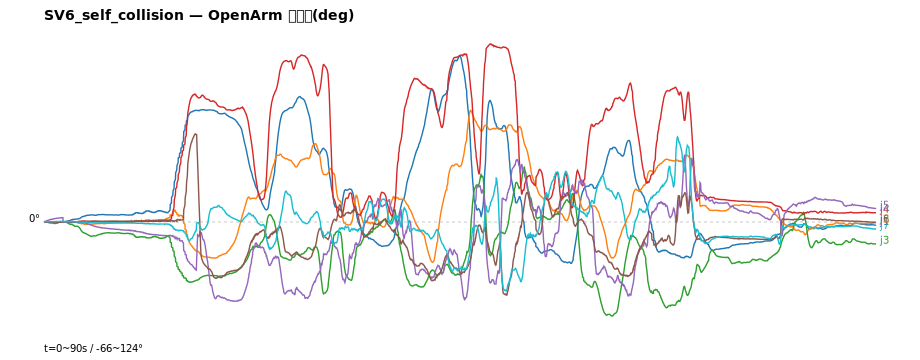

# 시뮬(viz OpenArm) 운동학 검증 보고서

- 생성: 2026-06-15 15:08
- 분해: bridge.py + calib_ik.py (실물 esp 앱과 동일)
- 검증 범위: 매핑·부호·작업공간·연속성 (안전·동역학은 ROS2/실물 영역)

## 20260615_150705_SV6_self_collision.csv

- 시나리오: **SV6_self_collision** | 길이: 90s / 4807프레임 | 손목매핑: {"1": 1, "2": 2, "3": 3, "4": 4, "5": 5, "6": 7, "7": 6} | 부호: {"1": -1, "2": 1, "3": 1, "4": -1, "5": 1, "6": -1, "7": 1}

### 작업공간 (OpenArm 관절한계 대비)

| 관절 | 적용범위(°) | URDF 한계(°) | 사용률 | 초과 |
|---|---|---|---|---|
| j1 어깨1 | -29~+116 | -80~200 | 52% | ✅ |
| j2 어깨2 | -28~+78 | -10~190 | 53% | ⚠ 10% |
| j3 어깨비틀 | -66~+38 | -90~90 | 58% | ✅ |
| j4 팔꿈치 | -0~+124 | 0~140 | 89% | ⚠ 4% |
| j5 손목롤 | -56~+46 | -90~90 | 57% | ✅ |
| j6 손목J6 | -51~+61 | -45~45 | 125% | ⚠ 2% |
| j7 손목J7 | -48~+59 | -45~45 | 120% | ⚠ 2% |

> ⚠ 작업공간 초과 관절: j2, j4, j6, j7 — 사람 동작범위 > OpenArm 관절한계 (클램프/동작 제한 필요)

### 연속성 · FK잔차

- 프레임간 점프(>30°): 
- 최대 프레임 스텝: j1=6° j2=4° j3=6° j4=5° j5=9° j6=6° j7=9°
- FK잔차 최대 0.0° / >5° 비율 0.0% ✅

