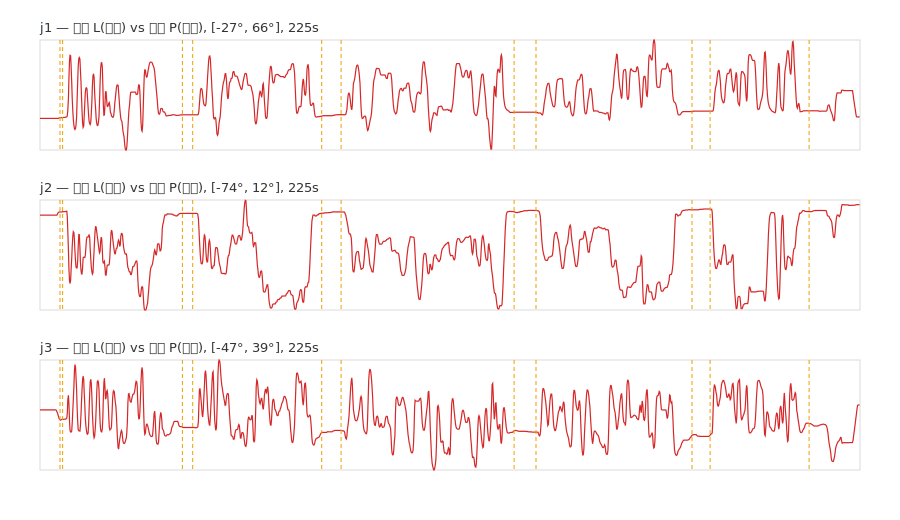
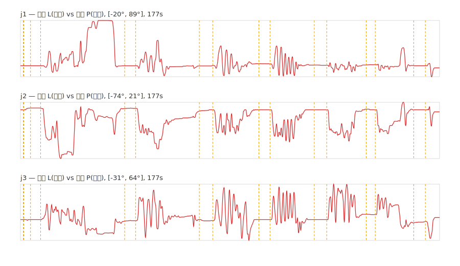
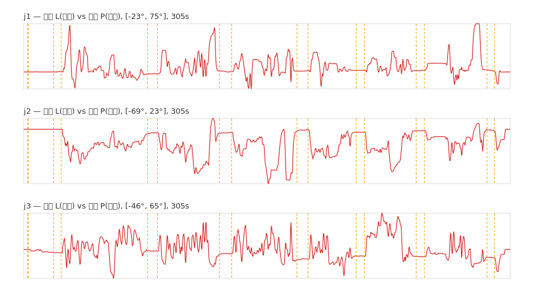

# 미니 팔로우암 검사 결과 보고서

- 생성: 2026-06-12 21:44
- 판정 기준: inspection_criteria.json (등급 A/B/C, 미달 F)
- 측정기 자기검증(검교정): 34/34 통과

## 20260612_161202_HM_human.csv

- 시나리오: **HM_human** | 모드: calib_ik | 길이: 225s | 읽기실패틱: 0
- 검사 관절: [1, 2, 3, 4, 5, 6, 7] | 정지구간: 4개 | 종합판정: **C**

> ⚠ 입력 기준기(리더) 없음 — 사람 착용 '반증' 모드(불합격은 유효, 합격은 추종·게인 인증 아님)
> ⚠ 배회(K4)는 사람 떨림 포함 상한치 — 'still' 마크 쌍 기준
> ⚠ 드리프트(K5)는 정지구간 4개 출력 평균각 추세 회귀(unwrap 적용)

| 관절 | 지연(ms) | 추종RMS(°) | P95(°) | 최대(°) | 게인 | 정렬오프셋(°) | 배회(°) | 드리프트(°/min) | 반복(°) | 등급(최악) |
|---|---|---|---|---|---|---|---|---|---|---|
| j1 | — | — | — | — | — | — | 0.61 | 1.53 | — | B |
| j2 | — | — | — | — | — | — | 0.91 | 1.30 | — | B |
| j3 | — | — | — | — | — | — | 1.69 | -2.44 | — | C |
| j4 | — | — | — | — | — | — | 1.21 | 0.59 | — | B |
| j5 | — | — | — | — | — | — | 2.01 | 1.17 | — | C |
| j6 | — | — | — | — | — | — | 0.47 | 2.76 | — | C |
| j7 | — | — | — | — | — | — | 1.21 | 1.40 | — | B |

**참고: C(목표)→P(실제) 출력단 — 합부 무관, 내부 신호 기준 (센서·융합·분해 등 IK 상류 오류는 못 봄). ⚠ 큰 동작에서는 속도제한 포화로 지연 과대·게인 과소 — 절대 정확도가 아님**

| 관절 | C→P 지연(ms) | 게인 | 피크상관 |
|---|---|---|---|
| j1 | 165 | 0.962 | 0.99 |
| j2 | 172 | 0.964 | 0.99 |
| j3 | 160 | 0.989 | 0.99 |
| j4 | 142 | 0.978 | 0.99 |
| j5 | 156 | 0.969 | 0.97 |
| j6 | 174 | 0.956 | 0.96 |
| j7 | 141 | 0.963 | 0.98 |

- 주석 마크(판정 미사용): 5.5s:still_start, 6.2s:still_end, 39.1s:still_start, 41.9s:still_end, 77.4s:still_start, 82.7s:still_end, 130.2s:still_start, 136.3s:still_end, 179.1s:still_start, 184.1s:still_end, 211.3s:still_start

## 20260612_162311_HM_human.csv

- 시나리오: **HM_human** | 모드: calib_ik | 길이: 177s | 읽기실패틱: 0
- 검사 관절: [1, 2, 3, 4, 5, 6, 7] | 정지구간: 7개 | 종합판정: **F**

> ⚠ 입력 기준기(리더) 없음 — 사람 착용 '반증' 모드(불합격은 유효, 합격은 추종·게인 인증 아님)
> ⚠ 배회(K4)는 사람 떨림 포함 상한치 — 'still' 마크 쌍 기준
> ⚠ 드리프트(K5)는 정지구간 7개 출력 평균각 추세 회귀(unwrap 적용)

| 관절 | 지연(ms) | 추종RMS(°) | P95(°) | 최대(°) | 게인 | 정렬오프셋(°) | 배회(°) | 드리프트(°/min) | 반복(°) | 등급(최악) |
|---|---|---|---|---|---|---|---|---|---|---|
| j1 | — | — | — | — | — | — | 0.84 | 0.51 | — | B |
| j2 | — | — | — | — | — | — | 0.91 | -1.07 | — | B |
| j3 | — | — | — | — | — | — | 1.71 | 0.81 | — | C |
| j4 | — | — | — | — | — | — | 2.71 | 0.26 | — | C |
| j5 | — | — | — | — | — | — | 3.86 | 1.23 | — | F |
| j6 | — | — | — | — | — | — | 3.07 | -0.58 | — | F |
| j7 | — | — | — | — | — | — | 6.16 | 0.89 | — | F |

**참고: C(목표)→P(실제) 출력단 — 합부 무관, 내부 신호 기준 (센서·융합·분해 등 IK 상류 오류는 못 봄). ⚠ 큰 동작에서는 속도제한 포화로 지연 과대·게인 과소 — 절대 정확도가 아님**

| 관절 | C→P 지연(ms) | 게인 | 피크상관 |
|---|---|---|---|
| j1 | 163 | 0.963 | 0.98 |
| j2 | 169 | 0.952 | 0.98 |
| j3 | 163 | 0.987 | 0.98 |
| j4 | 142 | 0.981 | 0.98 |
| j5 | 207 | 0.885 | 0.89 |
| j6 | 208 | 0.927 | 0.92 |
| j7 | 176 | 0.946 | 0.94 |

- 주석 마크(판정 미사용): 1.4s:base_changed_j1_2048, 1.4s:base_changed_j2_2048, 1.4s:base_changed_j3_2048, 1.4s:base_changed_j4_2039, 1.4s:base_changed_j5_2046, 1.4s:base_changed_j6_2045, 1.4s:base_changed_j7_2049, 4.3s:still_start, 8.5s:still_end, 44.1s:still_start, 48.7s:still_end, 75.6s:still_start, 81.3s:still_end, 100.8s:still_start, 105.5s:still_end, 124.2s:still_start, 129.5s:still_end, 146.2s:still_start, 150.0s:still_end, 166.3s:still_start, 171.2s:still_end

## 20260612_180333_HM_human.csv

- 시나리오: **HM_human** | 모드: calib_ik | 길이: 305s | 읽기실패틱: 0
- 검사 관절: [1, 2, 3, 4, 5, 6, 7] | 정지구간: 7개 | 종합판정: **C**

> ⚠ 입력 기준기(리더) 없음 — 사람 착용 '반증' 모드(불합격은 유효, 합격은 추종·게인 인증 아님)
> ⚠ 배회(K4)는 사람 떨림 포함 상한치 — 'still' 마크 쌍 기준
> ⚠ 드리프트(K5)는 정지구간 7개 출력 평균각 추세 회귀(unwrap 적용)

| 관절 | 지연(ms) | 추종RMS(°) | P95(°) | 최대(°) | 게인 | 정렬오프셋(°) | 배회(°) | 드리프트(°/min) | 반복(°) | 등급(최악) |
|---|---|---|---|---|---|---|---|---|---|---|
| j1 | — | — | — | — | — | — | 1.19 | 0.85 | — | B |
| j2 | — | — | — | — | — | — | 1.23 | 0.13 | — | B |
| j3 | — | — | — | — | — | — | 1.44 | -2.35 | — | C |
| j4 | — | — | — | — | — | — | 1.64 | -0.04 | — | C |
| j5 | — | — | — | — | — | — | 2.14 | 2.60 | — | C |
| j6 | — | — | — | — | — | — | 0.52 | 0.05 | — | B |
| j7 | — | — | — | — | — | — | 0.60 | 0.36 | — | B |

**참고: C(목표)→P(실제) 출력단 — 합부 무관, 내부 신호 기준 (센서·융합·분해 등 IK 상류 오류는 못 봄). ⚠ 큰 동작에서는 속도제한 포화로 지연 과대·게인 과소 — 절대 정확도가 아님**

| 관절 | C→P 지연(ms) | 게인 | 피크상관 |
|---|---|---|---|
| j1 | 167 | 0.949 | 0.98 |
| j2 | 170 | 0.965 | 0.98 |
| j3 | 159 | 0.997 | 0.99 |
| j4 | 128 | 0.987 | 0.97 |
| j5 | 161 | 0.994 | 0.96 |
| j6 | 166 | 0.958 | 0.94 |
| j7 | 140 | 0.971 | 0.95 |

- 주석 마크(판정 미사용): 2.7s:base_changed_j1_2048, 2.7s:base_changed_j2_2048, 2.7s:base_changed_j3_2048, 2.7s:base_changed_j4_2039, 2.7s:base_changed_j5_2048, 2.7s:base_changed_j6_2044, 2.7s:base_changed_j7_2049, 18.8s:still_start, 23.5s:still_end, 77.7s:still_start, 83.9s:still_end, 122.8s:still_start, 130.5s:still_end, 171.4s:still_start, 178.4s:still_end, 208.6s:still_start, 213.8s:still_end, 246.3s:still_start, 251.4s:still_end, 290.7s:still_start, 295.4s:still_end

